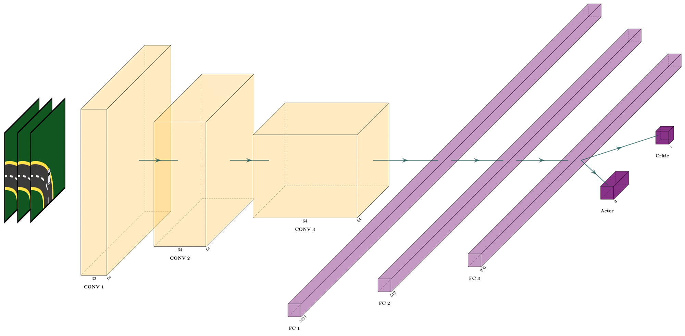
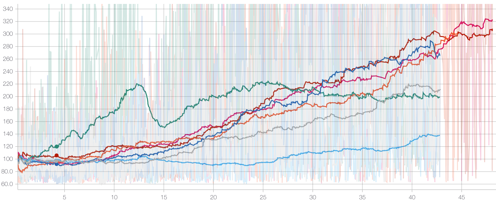

# Implementation of Advantage Actor-Critic Algorithm (A2C)

## Environment

 - Observation Space: `[64, 64, 1]`
 - Action Space: `[3]`

## Model

  <b>Neural Network Architecture</b> 
  

 - Input Tensor with Dimensions `[64,64,5]`
 - Convolutional Layer with filter size `[8,8]` and strides `[4,4]` and ReLU activation
 - Convolutional Layer with filter size `[4,4]` and strides `[2,2]` and ReLU activation
 - Convolutional Layer with filter size `[3,3]` and strides `[1,1]` and ReLU activation
 - Fully-Connected Layer with 1024 neurons and ReLU activation
 - Fully-Connected Layer with 512 neurons and ReLU activation
 - Fully-Connected Layer with 256 neurons and ReLU activation
 - Policy Head with 3 output neurons and Value head with 1 output neurons

 ## Results

  <b>Smothed average episode reward vs number of training steps</b> 
  

  <b>Sample Run</b> 
  

